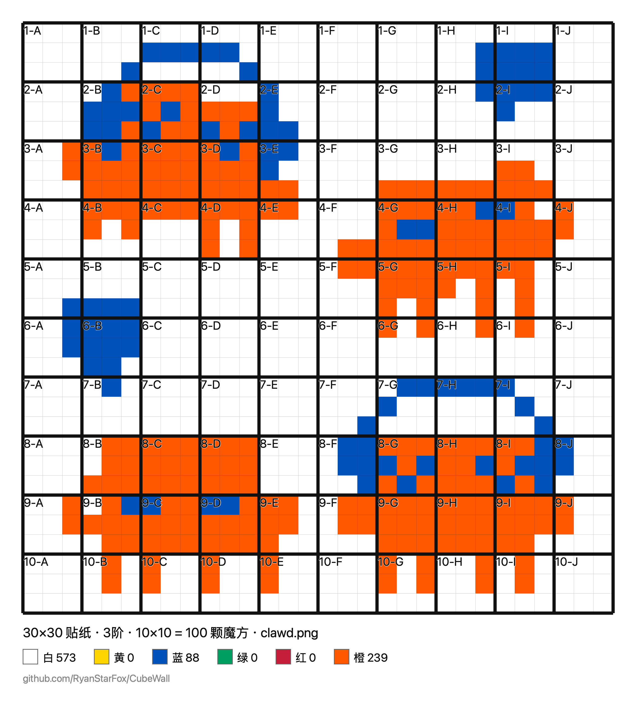

简体中文 | [English](README.en.md)

# 魔方墙图纸生成器

上传一张图片，生成用魔方拼成一面墙的施工图纸。

图片只在浏览器里处理，不会上传到任何服务器。

## 使用

在线试用：https://cube.ryanstarfox.top

也可以下载 `index.html`，双击用浏览器打开即可。没有构建步骤，不需要安装任何东西。

## 功能

- **图片量化**：把图片转成魔方贴纸的六种颜色（白、黄、蓝、绿、红、橙）。
- **魔方阶数**：2×2 / 3×3 / 4×4 / 5×5，也可自定义 N×N（N 取 2–10）。默认三阶。
- **尺寸**：以贴纸数设定宽高，自动对齐到阶数的倍数，实时显示需要多少颗魔方。默认 30×30 贴纸，即 10×10 = 100 颗三阶魔方。
- **比例不符时**：可选裁切、补白（边框颜色可选）或按原图比例自动改尺寸。默认补白。
- **多图拼接**：一次可加多张图，用「铺满 / 横排 / 竖排 / 方阵」快速排列，也能在预览里直接拖动图层改位置、拉角改大小，支持重叠与层叠顺序。
- **自定义裁切**：选中图层后切到「取景」，在框内拖动平移、滚轮缩放。裁切是可逆的——原图完整保留，随时能把切掉的部分拖回来。
- **自定义配色**：六种颜色的色值都能改，浏览器会记住，随时可恢复标准配色。
- **手动上色**：切到「上色」模式后，有画笔、矩形填充、油漆桶（填相连同色区域）、同色全换四种工具，支持撤销重做（⌘Z / ⌘⇧Z）。注意回到排版做任何改动都会重新量化，覆盖手工涂的格子。
- **抖动**：0–100% 可调。0% 边界干净，适合色块图；照片想要层次可调到 40–60%。
- **输出**：图纸带贴纸细线、魔方粗线分块和 `1-A` 式编号，附六色图例与各色贴纸用量，可下载 PNG 或直接打印。

## 说明

`Examples/` 里是用这个工具生成的成品图纸。设计与实现决策记录在 `docs/superpowers/specs/`。

## 许可证

[MIT](LICENSE)
