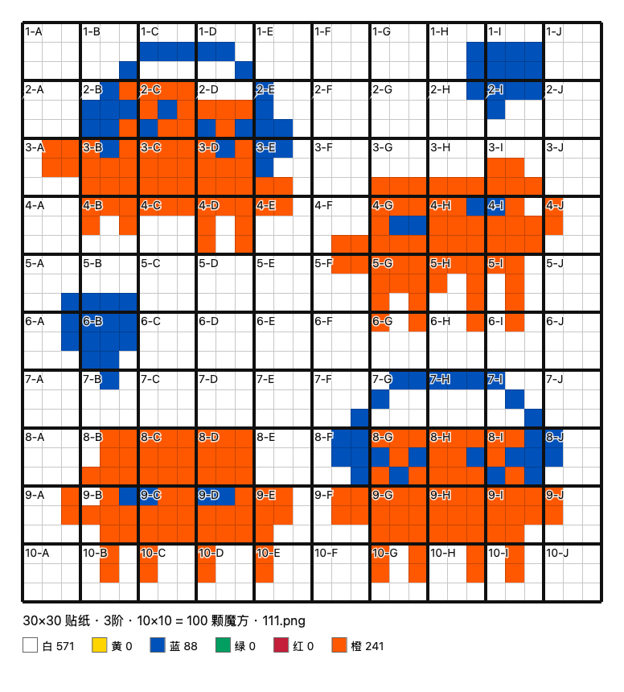

English | [简体中文](README.zh-CN.md)

# Cube Wall Blueprint Generator

Upload an image and get a build blueprint for a wall made of Rubik's cubes.

Everything runs in your browser. Your images are never uploaded anywhere.

## Getting started

Download `index.html` and open it in a browser. No build step, nothing to install.

## Features

- **Colour quantisation** — maps any image onto the six cube sticker colours (white, yellow, blue, green, red, orange).
- **Cube size** — 2×2, 3×3, 4×4, 5×5, or a custom N×N with N from 2 to 7. Defaults to 3×3.
- **Wall size** — set width and height in stickers; values snap to a multiple of the cube size, and the required cube count is shown live. Defaults to 30×30 stickers, i.e. 10×10 = 100 standard cubes.
- **Aspect handling** — crop, pad (with your choice of border colour), or resize the wall to match the image. Defaults to padding.
- **Multi-image collage** — add several images at once and lay them out with *Fill*, *Row*, *Column* or *Grid*, or drag layers freely in the preview, resize them by their corners, and overlap them in any stacking order.
- **Non-destructive cropping** — select a layer, switch to *Framing*, then drag to pan and scroll to zoom. The original image is kept intact, so anything you crop away can always be brought back.
- **Custom palette** — every one of the six colours can be edited. Your choices are remembered, and the standard palette is one click away.
- **Manual painting** — switch to *Paint* mode for brush, rectangle fill, bucket fill (contiguous same-colour region) and global colour replace, with undo/redo (⌘Z / ⌘⇧Z). Note that any later layout change re-quantises the image and overwrites manual edits.
- **Dithering** — adjustable from 0 to 100%. Use 0% for flat-colour artwork and clean edges; 40–60% brings out gradients in photographs.
- **Output** — the blueprint shows thin sticker lines, bold cube boundaries and `1-A` style block labels, along with a colour legend and a per-colour sticker count. Download as PNG or print directly.

## Notes

`Examples/` contains finished blueprints produced with this tool. Design and implementation decisions are recorded in `docs/superpowers/specs/`.
